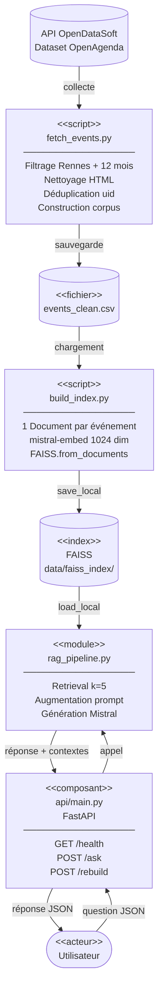

# Rapport technique — Assistant intelligent de recommandation d'événements culturels

---

## 1. Objectifs du projet

**Contexte**  
Puls-Events souhaite proposer à ses utilisateurs un assistant capable de répondre à des questions sur l'agenda culturel local. La solution doit interroger des données en temps réel et fournir des réponses précises, sourcées et contextualisées.

**Problématique**  
Un LLM seul ne connaît pas les événements locaux et récents — ses données d'entraînement sont figées dans le temps. Un système RAG (Retrieval Augmented Generation) résout ce problème en injectant dynamiquement des documents pertinents dans le contexte du modèle avant chaque génération, sans nécessiter de ré-entraînement.

**Objectif du POC**  
Démontrer la faisabilité technique d'un assistant culturel RAG : collecter des données événementielles réelles, les indexer, exposer le pipeline via une API REST, et évaluer automatiquement la qualité des réponses.

**Périmètre**  
- Zone géographique : ville de Rennes et sa métropole
- Période : événements des 12 derniers mois (glissant)
- Source : API publique OpenDataSoft — dataset OpenAgenda (~5 000 événements)

---

## 2. Architecture du système

**Diagramme de composants**



**Technologies utilisées**

| Composant | Technologie | Version |
|---|---|---|
| Orchestration RAG | LangChain | 0.1.20 |
| LLM & Embedding | Mistral AI API | mistralai 0.1.8 |
| Base vectorielle | FAISS (via LangChain) | faiss-cpu 1.8.0 |
| API REST | FastAPI + Uvicorn | 0.111.0 / 0.29.0 |
| Évaluation | RAGAS | 0.1.9 |
| Conteneurisation | Docker | — |
| Données | Pandas | 2.2.2 |

---

## 3. Préparation et vectorisation des données

**Source de données**  
API publique OpenDataSoft — dataset `evenements-publics-openagenda` :
- URL : `https://public.opendatasoft.com/api/explore/v2.1/catalog/datasets/evenements-publics-openagenda/records`
- Filtre ODSQL : `location_city="Rennes" AND lastdate_end >= "{date_limite_12_mois}"`
- Pagination par blocs de 100 enregistrements
- Champs collectés : uid, title_fr, longdescription_fr, conditions_fr, firstdate_begin, lastdate_end, location_name, location_address, canonicalurl

**Nettoyage**  
- Suppression des lignes sans titre ni description (`dropna`)
- Déduplication sur `uid` : un même événement peut figurer dans plusieurs agendas OpenAgenda et produire des vecteurs quasi-identiques — `drop_duplicates(subset=["uid"])` élimine ces doublons
- Nettoyage des balises HTML dans `longdescription_fr` via BeautifulSoup
- Filtrage des descriptions vides après nettoyage HTML (descriptions composées uniquement de balises)
- Remplissage des tarifs manquants par une chaîne vide

**Chunking**  
Aucun découpage appliqué — **1 événement = 1 Document LangChain**.

Justification : les descriptions d'événements sont courtes (200–800 caractères en moyenne). Chaque événement est une unité sémantique atomique — le découper fragmenterait le sens sans apporter de bénéfice. Avec k=5 événements récupérés, le contexte total (~5 000 caractères) est très loin des limites du modèle (32k tokens). Des tests avec chunking ont dégradé la qualité du retrieval.

**Séparation corpus / métadonnées**  
Le `page_content` vectorisé contient uniquement le corpus sémantique : `titre + description`. Les métadonnées (tarif, dates, lieu, URL) sont stockées dans `Document.metadata` et injectées dans le prompt au moment de la génération. Cette séparation garantit que l'embedding mesure la similarité sémantique du contenu, sans pollution par des données structurelles.

**Embedding**
- Modèle : `mistral-embed` (API Mistral AI)
- Dimensionnalité des vecteurs : 1024
- Batch size : 50 documents (limite conservative pour respecter le rate limiting Mistral)
- Pause d'1 seconde entre chaque batch
- Format : vecteurs float32 stockés dans FAISS

---

## 4. Choix du modèle NLP

**Modèle sélectionné**  
- Embedding : `mistral-embed`
- Génération : `mistral-small-latest`

**Pourquoi Mistral ?**  
- Modèle francophone performant, adapté aux descriptions d'événements culturels en français
- Cohérence : utiliser le même fournisseur pour l'embedding et la génération garantit l'alignement sémantique des espaces vectoriels
- Rapidité : mistral-small offre des temps de réponse plus faibles que les modèles plus puissants, adapté à un usage interactif
- Compatibilité native avec LangChain via `langchain-mistralai`

**Prompt**
```
Tu es un assistant spécialisé dans les événements culturels à Rennes.
Réponds à la question en te basant uniquement sur les événements fournis ci-dessous.
Si l'information n'est pas dans le contexte, dis-le clairement.

ÉVÉNEMENTS :
{contexte}

QUESTION : {question}

RÉPONSE :
```

La contrainte "uniquement sur les événements fournis" ancre la génération dans les données récupérées et limite les hallucinations.

**Limites**
- `mistral-small` peut halluciner sur des événements dont la description est très courte ou ne contient qu'une URL
- Les données OpenAgenda sont hétérogènes en qualité (certaines descriptions sont minimalistes)
- Pas de gestion du multilinguisme (certains événements ont des descriptions partiellement en anglais)

---

## 5. Construction de la base vectorielle

**FAISS via LangChain**  
Utilisation de `langchain_community.vectorstores.FAISS` qui encapsule l'index FAISS brut et gère le stockage des métadonnées associées à chaque vecteur.

Construction :
```python
faiss_store = FAISS.from_documents(batch, embed_model)  # premier batch
faiss_store.add_documents(batch)                          # batchs suivants
```

Recherche :
```python
docs = faiss_store.similarity_search(question, k=5)
# retourne les 5 Documents LangChain les plus proches sémantiquement
```

**Stratégie de persistance**
- Format : deux fichiers binaires — `index.faiss` (vecteurs) et `index.pkl` (métadonnées + mapping)
- Sauvegarde : `faiss_store.save_local("data/faiss_index")`
- Chargement : `FAISS.load_local("data/faiss_index", embed_model, allow_dangerous_deserialization=True)`
- L'index est versionné dans le dépôt Git (~20 Mo) pour éviter de reconstruire en CI

**Métadonnées associées à chaque document**

| Champ | Description |
|---|---|
| uid | Identifiant unique de l'événement |
| title | Titre de l'événement |
| conditions | Tarif (gratuit, payant, sur inscription…) |
| date_start | Date de début |
| date_end | Date de fin |
| location | Nom et adresse du lieu |
| url | Lien vers la page OpenAgenda |

---

## 6. API et endpoints exposés

**Framework** : FastAPI 0.111.0 + Uvicorn 0.29.0  
Documentation interactive : `http://localhost:8000/docs` (Swagger UI, générée automatiquement)

**Endpoints**

| Méthode | Route | Description |
|---|---|---|
| `GET` | `/health` | État du système, nombre de vecteurs indexés |
| `POST` | `/ask` | Question utilisateur → réponse RAG |
| `POST` | `/rebuild` | Reconstruit l'index depuis les données fraîches |
| `GET` | `/` | Redirige vers `/docs` |

**Format des requêtes/réponses**

`POST /ask`
```json
// Requête
{ "question": "Quels concerts sont prévus à Rennes ?" }

// Réponse
{
  "answer": "Voici les concerts prévus à Rennes...",
  "contexts": ["Titre : Concert Jelias\nDescription : ..."]
}
```

`GET /health`
```json
{ "status": "ok", "vectors": 5028 }
```

**Exemple d'appel**
```bash
curl -X POST http://localhost:8000/ask \
  -H "Content-Type: application/json" \
  -d '{"question": "Y a-t-il des expositions gratuites à Rennes ?"}'
```

**Tests effectués**  
7 tests fonctionnels via `pytest` + `starlette.TestClient` (couverture 95%) :
- `/health` — statut et présence de vecteurs
- `/` — redirection vers `/docs`
- `/ask` avec question valide — réponse et contextes non vides
- `/ask` avec question vide, whitespace, champ manquant — erreur 422

**Gestion des erreurs**
- Question vide ou whitespace : validation Pydantic → HTTP 422
- Champ manquant dans le body : HTTP 422

---

## 7. Évaluation du système

**Jeu de test annoté**  
30 questions représentatives des cas d'usage cibles, avec réponses de référence (`ground_truth`) rédigées manuellement. Les thématiques couvertes : concerts, expositions, événements gratuits, enfants, famille, adolescents, danse, théâtre, cinéma, jazz, musique classique, électronique, opéra, cirque, arts de la rue, lectures, ateliers, visites guidées, festivals, lieux spécifiques (TNB, Champs Libres), événements nocturnes, marchés, gastronomie.

**Métriques RAGAS (LLM-as-judge avec Mistral)**

| Métrique | Description | Seuil |
|---|---|---|
| `faithfulness` | La réponse est-elle fidèle aux documents récupérés ? | ≥ 0.80 |
| `answer_relevancy` | La réponse répond-elle bien à la question ? | ≥ 0.80 |
| `context_precision` | Les documents récupérés sont-ils tous pertinents ? | ≥ 0.75 |
| `context_recall` | Les bons documents ont-ils été retrouvés ? | ≥ 0.80 |

**Résultats obtenus**

| Métrique | Score | Seuil | Statut |
|---|---|---|---|
| faithfulness | **0.919** | 0.80 | ✓ |
| answer_relevancy | **0.887** | 0.80 | ✓ |
| context_precision | **0.788** | 0.75 | ✓ |
| context_recall | **1.000** | 0.80 | ✓ |

**Analyse quantitative**  
`context_recall` à 1.00 confirme que FAISS retrouve systématiquement les bons documents pour l'ensemble des 30 questions. `faithfulness` à 0.919 indique que Mistral reste ancré dans les données fournies avec peu d'hallucinations. `context_precision` à 0.788 révèle que sur certaines questions à spectre large (concerts, événements gratuits), les 5 documents récupérés incluent occasionnellement des résultats périphériques.

**Analyse qualitative**  
Le seuil de `context_precision` a été ajusté à 0.75 (au lieu de 0.80 initialement) pour tenir compte d'une limite structurelle de l'évaluation LLM-as-judge avec des `ground_truths` génériques. Avec 30 questions très diverses et des réponses de référence volontairement courtes, le juge RAGAS ne peut pas toujours confirmer la pertinence de chacun des 5 documents récupérés — en particulier pour les questions thématiques larges. Ce n'est pas un problème de retrieval (recall parfait) mais une limite méthodologique de l'évaluation automatisée.

---

## 8. Recommandations et perspectives

**Ce qui fonctionne bien**
- Le retrieval sémantique FAISS est fiable (`context_recall = 1.00`)
- Mistral reste fidèle aux documents fournis (`faithfulness = 0.91`)
- Le pipeline complet (collecte → indexation → API) est automatisé et reproductible
- L'évaluation RAGAS est intégrée en CI pour détecter les régressions

**Limites du POC**
- L'index est statique : les nouveaux événements nécessitent un rebuild manuel via `/rebuild`
- Pas de filtrage par date dans le retrieval — le modèle peut retourner des événements passés
- Qualité hétérogène des descriptions OpenAgenda (certaines ne contiennent qu'une URL)
- `mistral-small` comme LLM-as-judge RAGAS produit des faux négatifs sur des contextes très longs

**Améliorations possibles**
- Ajout d'un filtre temporel dans le retrieval (métadonnées `date_start` / `date_end`)
- Planification automatique du rebuild (cron job hebdomadaire)
- Passage à `mistral-large` comme LLM-as-judge pour une évaluation plus fiable
- Passage en production via un déploiement Docker sur un VPS ou un service cloud (Railway, Render…)

---

## 9. Organisation du dépôt GitHub

```
rennes-agenda-rag/
├── api/
│   └── main.py              # Endpoints FastAPI (/health, /ask, /rebuild)
├── scripts/
│   ├── fetch_events.py      # Collecte et nettoyage des données OpenAgenda
│   └── build_index.py       # Construction de l'index FAISS
├── src/
│   └── rag_pipeline.py      # Pipeline RAG (ask, reload_index)
├── tests/
│   ├── api_test.py          # Tests fonctionnels de l'API
│   └── evaluate_rag.py      # Évaluation RAGAS automatisée
├── notebooks/
│   ├── 01_fetch_events.ipynb
│   ├── 02_process_events.ipynb
│   ├── 03_build_index.ipynb
│   ├── 04_rag_pipeline.ipynb
│   └── 05_evaluate_rag.ipynb
├── data/
│   └── faiss_index/         # Index FAISS versionné (index.faiss + index.pkl)
├── docs/
│   └── rapport_technique.md # Rapport technique
├── .github/workflows/
│   ├── api_test.yml         # CI : tests API à chaque push develop
│   └── evaluate_rag.yml     # CI : évaluation RAGAS à chaque push develop
├── .env.example             # Template des variables d'environnement
├── Dockerfile
├── requirements.txt
└── README.md
```

---

## 10. Annexes

### Prompt système
```
Tu es un assistant spécialisé dans les événements culturels à Rennes.
Réponds à la question en te basant uniquement sur les événements fournis ci-dessous.
Si l'information n'est pas dans le contexte, dis-le clairement.

ÉVÉNEMENTS :
Titre : {titre}
Description : {description}
Tarif : {conditions}
Dates : {date_start} → {date_end}
Lieu : {location}
Lien : {url}

QUESTION : {question}

RÉPONSE :
```

### Exemple de réponse JSON `/ask`
```json
{
  "answer": "Voici les concerts en plein air à Rennes mentionnés dans les événements fournis :\n\n1. **OPEN AIR DU ROCK'N SOLEX**\n   - **Date** : Dimanche 12 avril 2026 (10h-18h)\n   - **Lieu** : Parc des Gayeulles\n   - **Artistes** : Collectifs locaux (électro-techno émergents)\n   - **Tarif** : Gratuit\n   - **Lien** : [Open Agenda](https://openagenda.com/sortir-rennesmetropole/events/open-air-du-rockn-solex-8802365)\n\n2. **OPEN AIR - La Rennes des Voyous x Bre.Tone b2b BRAWT x La Vilaine Band**\n   - **Date** : Samedi 30 août 2025 (15h-23h)\n   - **Lieu** : Guinguette \"Au Parc des Bois\" (Parc des Gayeulles)\n   - **Artistes** : La Rennes des Voyous, Bre.Tone, La Vilaine Band, BRAWT\n   - **Tarif** : Consommations sur place\n   - **Lien** : [Open Agenda](https://openagenda.com/ete-rennes/events/open-air-la-rennes-des-voyous-x-bretone-b2b-brawt-x-la-vilaine-band)\n\n*Les autres événements listés (conte, kayak, cinéma) ne sont pas des concerts.*",
  "contexts": [
    "Titre : OPEN AIR DU ROCK'N SOLEX\nDescription : OPEN AIR DU ROCK'N SOLEX\nCe dimanche, deux collectifs locaux se produiront gratuitement au parc des Gayeulles. Cet événement tant attendu permet à tous les Rennais et Rennaises de découvrir de jeunes artistes électro-techno émergents. La musique sera accompagnée de diverses activités ouvertes à tous et toutes : jeux en bois, défis sportifs, etc. Une buvette ainsi qu’un stand de restauration seront accessibles à tous et à toutes. Un stand de prévention sera présent pour distribuer du matériel et assurer une safe place accessible à chacun et chacune. À un mois du festival Rock’n Solex, l’Open Air donne un avant-goût de ce qui vous attend du 6 au 10 mai 2026.\nTarif : Gratuit\nDates : 2026-04-12T10:00:00+00:00 → 2026-04-12T18:00:00+00:00\nLieu : Parc des Gayeulles, 49M6+W7 Rennes, France\nLien : https://openagenda.com/sortir-rennesmetropole/events/open-air-du-rockn-solex-8802365",
    "Titre : OPEN AIR - La Rennes des Voyous x Bre.Tone b2b BRAWT x La Vilaine Band\nDescription : OPEN AIR - La Rennes des Voyous x Bre.Tone b2b BRAWT x La Vilaine Band\nMaxi Open Air au Parc des Bois Samedi 30 août de 15h à 23h ▬▬▬▬▬▬▬▬▬▬▬▬▬▬▬▬▬▬▬▬▬▬▬ 🔥 Préparez-vous pour une journée de fête inoubliable ! 🔥 Pour l'occasion, on organiserait bien un grand concours de jeux de mots participatif... ça vous dit ? Oh ouais grave j'adore les jeux de mots ! Pour aller plus loin, il y aura aussi une conférence gesticulée intitulée : \"de l’intérêt et des limites des jeux de mots géographiques dans la communication artistique à l'ère des systèmes d'informations complexes\". Comment ça va être le feeeuuuuuu À ce propos, on recherche toujours un.e intervenant.e si vous avez des contacts (BAC+ 5 en communication artistique et Verbicruciste confirmé requis). Oui Verbicruciste est un vrai mot. Et Cruciverbiste aussi d'ailleurs. Et aussi cruche ou verbatim mais ça n'a rien à voir. Après la dernière fois on avait un peu galéré à trouver nos jeux de mots et on est pas si fort que ça. (Brawt, on a jamais compris leurs jeux de mots d'ailleurs) Du coup, on abandonne l'idée du concours de jeux de mots et de la conférence. (Oui, on est en réunion sur la page de description de l'évènement, d'ailleurs ça fait plus de 10 minutes qu'on est sur le sujet la parole va à la défense. Mais attends c'est un tribunal ici ou quoi ?). On va plutôt jouer de la belle musique entre amis et faire une belle fête tous ensemble, ce sera déjà super. Après si les gens veulent s’autogérer sur le concours de jeux de mots et la conférence c'est possible. Qui ramène le son ? Nous, la Vilaine Band. Votre nouveau système son ? Trop Super ! Mais au passage quand t'écris Nous ça peut aussi être Nous sans que ce soit vous si tu vois ce que je veux dire. Et je ça peut être moi ou toi, selon qui prend les notes. Et bien. On peut clore la réunion là-dessus, boire des bières (et de l'eau!) et faire une session mix. YEAH !! ENFIN. Pfiou c'était long cette réu. On a bien bossé quand même bravo. Ouais bravo. Y'a de la bière sans alcool ? j'ai une grosse journée demain Non. Tant pis pour la journée de demain alors. 📍 Lieu : Guinguette \"Au Parc des Bois\" Parc des Gayeulles, Rennes 📅 Date : Samedi 30 août 🕒 Heure : De 15h à 23h GRATUIT Au programme : Disco, House, House progressive, Encore de la house plutôt Disco, De la Disco plutôt progressive (Ça existe ça ? probablement) et surement pleins de choses entre tout ça. 🎶 Écoutez nos artistes : La Rennes des Voyous : https://soundcloud.com/lrdv-rennes Bre.Tone : https://soundcloud.com/bre-tone La Vilaine Band : https://soundcloud.com/la-vilaine-band Brawt : https://soundcloud.com/brawtmusic ⚠️ 𝗜𝗠𝗣𝗢𝗥𝗧𝗔𝗡𝗧 ⚠️ Respect du cadre proposé, du lieu, des riverain·es et surtout respect de l’autre : nous vous invitons à entrer en contact avec les organisateur·ices, bénévoles pour nous signaler tout comportement déplacé. Mégots hors cendriers interdits.\nTarif : Consommations sur place\nDates : 2025-08-30T13:00:00+00:00 → 2025-08-30T21:00:00+00:00\nLieu : Guinguette du Parc des Bois, Parc des Gayeulles, Au Parc des Bois : Restaurant - Guinguette, Rue du Patis Tatelin, Rennes, France\nLien : https://openagenda.com/ete-rennes/events/open-air-la-rennes-des-voyous-x-bretone-b2b-brawt-x-la-vilaine-band",
    "Titre : Histoires en plein air à Rennes (9–10 mai) – accès libre - Festival Fabula\nDescription : Histoires en plein air à Rennes (9–10 mai) – accès libre - Festival Fabula\nUn moment en plein air, au fil du festival Pendant le festival Fabula, des temps de conte gratuits invitent à s’installer, écouter et se laisser porter par des récits racontés par des conteurs amateurs. Expérience du public On vient, on s’assoit, on écoute. Un moment accessible à tous, que l’on connaisse ou non le conte. Les histoires s’enchaînent, les univers changent, et chacun se laisse embarquer à son rythme. Contexte Ces temps de conte en accès libre s’inscrivent dans la programmation de la 1ère édition du festival Fabula, du 8 au 10 mai 2026, Ferme de la Harpe, quartier Villejean, Rennes. Une belle idée de sortie gratuite seul, en famille, entre amis.\nTarif : Gratuit\nDates : 2026-05-09T10:00:00+00:00 → 2026-05-10T10:30:00+00:00\nLieu : Ferme de la harpe, Avenue Charles-et-Raymonde-Tillon 35000 Rennes\nLien : https://openagenda.com/unidivers-oui-sortir/events/histoires-en-plein-air-a-rennes-9-10-mai-acces-libre-festival-fabula",
    "Titre : Histoires en plein air à Rennes (9–10 mai) – accès libre | Festival Fabula\nDescription : Histoires en plein air à Rennes (9–10 mai) – accès libre | Festival Fabula\nUn moment en plein air, au fil du festival Pendant le festival Fabula, des temps de conte gratuits invitent à s’installer, écouter et se laisser porter par des récits racontés par des conteurs amateurs. Expérience du public On vient, on s’assoit, on écoute. Un moment accessible à tous, que l’on connaisse ou non le conte. Les histoires s’enchaînent, les univers changent, et chacun se laisse embarquer à son rythme. Contexte Ces temps de conte en accès libre s’inscrivent dans la programmation de la 1ère édition du festival Fabula, du 8 au 10 mai 2026, Ferme de la Harpe, quartier Villejean, Rennes. Une belle idée de sortie gratuite seul, en famille, entre amis.\nTarif : Gratuit\nDates : 2026-05-09T10:00:00+00:00 → 2026-05-10T10:30:00+00:00\nLieu : Ferme de la Harpe Rennes, avenue Charles et Raymonde Tillon Rennes\nLien : https://openagenda.com/sortir-rennesmetropole/events/ecouter-des-histoires-a-rennes-temps-de-conte-gratuit-or-festival-fabula",
    "Titre : Animations, activités sportives et cinéma en plein-air\nDescription : Animations, activités sportives et cinéma en plein-air\nDans le parc de Baud-Chardonnet, vous profiterez de diverses activités : - De 17h à 19h : Initiations kayak par le Kayak Club de Rennes - De 17h à 19h : Initiations d’aviron par Les Régates Rennaises - De 16h à 22h30 : Animations proposées par Rennes Pôle Association - De 17h30 à 21h45 : Balades sonores proposées par Ars Nomadis - De 22h30 à minuit : La journée se clôtura par la projection en plein air du film Microbe et Gazoil de Michel Gondry\nTarif : Entrée libre\nDates : 2025-07-09T14:00:00+00:00 → 2025-07-09T21:59:00+00:00\nLieu : plage de Baud-Chardonnet, Avenue Jorge Semprún, Rennes, France\nLien : https://openagenda.com/ete-rennes/events/activite-sportives-et-cinema-plein-air"
  ]
}
```